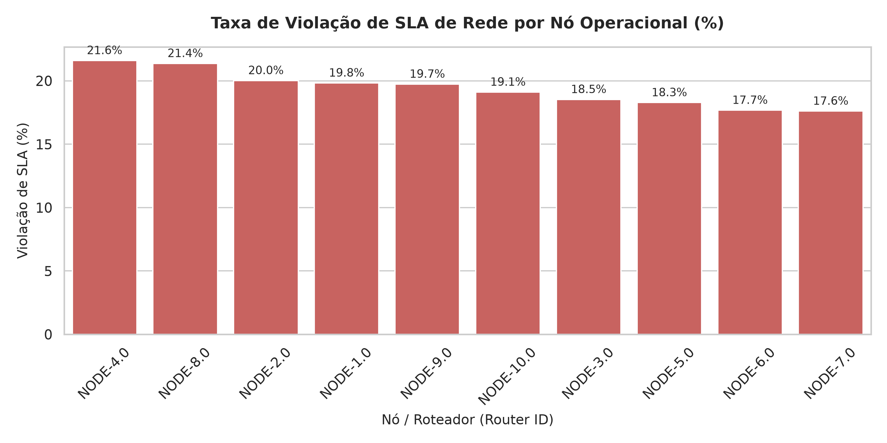
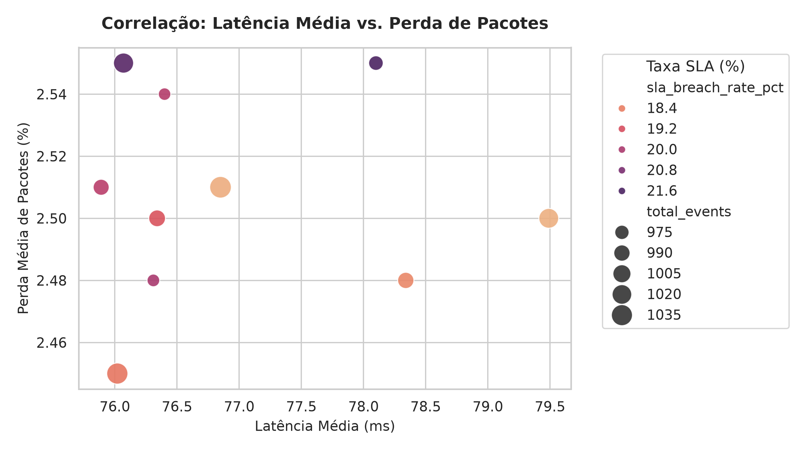

# 🌐 Telco Analytics Platform: Modern Data Architecture & Engineering

[](https://github.com/aestevaomoraes/telco-analytics-platform/actions/workflows/dbt_ci.yml)
[](https://duckdb.org/)
[](https://www.getdbt.com/)
[](https://github.com/features/actions)

## 1. Visão Executiva & Contexto de Negócio

No setor de Telecomunicações e Serviços Corporativos (TMT / B2B & B2C), a perda de clientes (*churn*) e a degradação da receita recorrente estão diretamente correlacionadas com incidentes operacionais de rede e violações contratuais de Service Level Agreement (SLA).

Esta plataforma implementa uma arquitetura moderna orientada ao ciclo de vida canónico de engenharia de dados. Transforma telemetria bruta de rede (CDRs, latência de enlace, perda de pacotes) em camadas analíticas dimensionais de alto desempenho, prontas para auditoria operacional, inteligência de negócio e consumo executivo.

### Objetivos Primordiais
* **Eliminar silos operacionais:** Unificar sinais de telemetria da infraestrutura com métricas contratuais de SLA.
* **Governança & Rastreabilidade Canónica:** Garantir integridade via *Data Contracts*, linhagem completa de dados (DAG) e idempotência.
* **Automação Contínua (CI/CD):** Bloquear regressões e desvios de esquema (*Schema Drift*) diretamente no ciclo de Pull Request via GitHub Actions.
* **Consumo Analítico Orientado a Decisão:** Expor métricas agregadas por nó de rede consumíveis via Python (Pandas/Seaborn) e ferramentas de BI.
---

## 2. Arquitetura da Solução & Ciclo Canônico

A solução implementa o ciclo canônico de Engenharia Analítica, desacoplando computação colunar analítica de alto desempenho da camada de orquestração e contratos:

```
[Raw Parquet] (10.000 eventos de telemetria bruta)
       │
       ▼ (DuckDB Engine)
[Staging: stg_telemetry] (Padronização 1:1, casting e flag de violação de SLA)
       │
       ▼ (dbt ref / DAG)
[Marts: agg_router_health] (Data Mart agregado de SLA por nó de rede)
       │
       ├─► [Data Contracts & CI/CD] (GitHub Actions: unique, not_null, accepted_values)
       ├─► [dbt Docs & Lineage] (Catálogo corporativo e DAG compilado)
       └─► [Consumo Analítico] (Python, Pandas, Seaborn & Matplotlib)

```

---

## 3. Diagnóstico Operacional de Rede (Consumo Analítico via Python & Seaborn)

Camada de exploração visual e diagnóstico analítico consumindo diretamente o Data Mart `agg_router_health` materializado no DuckDB:

### 1. Ranking de Violação de SLA por Nó Operacional
Identificação prioritária dos equipamentos de rede que excederam os limiares de latência e perda de pacotes:



### 2. Análise Multivariada de Causa Raiz
Correlação entre Latência Média ($X$), Perda de Pacotes ($Y$), Volume de Tráfego (tamanho do ponto) e Taxa de Violação de SLA (mapa de cor):



## 4. Estado Atual da Implementação (Ciclo 1: Fundação Local)

* [x] **Ingestão Sintética:** Gerador vetorial via DuckDB (`generate_telemetry.py`) produzindo 10.000 registros de telemetria em formato colunar Parquet (`raw_telemetry.parquet`).
* [x] **Exploração & Rastreabilidade:** Validação interativa via Jupyter Notebook (`exploracao_telemetria.ipynb`) documentando as etapas de dados brutos e materializações.
* [x] **Camada Staging:** Modelo `stg_telemetry` implementado com padronização de nomenclatura, casting e flag idempotente de violação de SLA (`is_sla_breached`).
* [x] **Data Marts:** Agregação executiva `agg_router_health` compilada via DAG usando `{{ ref() }}`, expondo taxa de violação por nó de rede.
* [ ] **Governança & Testes:** Implementação de testes de contrato e regras de schema (`schema.yml`) — *Em andamento*.

---

## 5. Como Reproduzir o Ambiente Local

Para executar o pipeline analítico localmente no ambiente DuckDB:

1. **Instale as dependências:**
    pip install dbt-duckdb

2. **Gere os dados brutos de telemetria:**
    python telco_analytics/generate_telemetry.py

3. **Compile e execute os modelos dbt:**
    cd telco_analytics
    dbt run --profiles-dir .

---

Observe que logo abaixo de `end` estão as três crases sozinhas na linha: elas fecham a caixa escura do diagrama[cite: 8]. Depois disso, basta alternar para **Preview** para verificar o layout limpo e clicar em **Commit changes...**.
